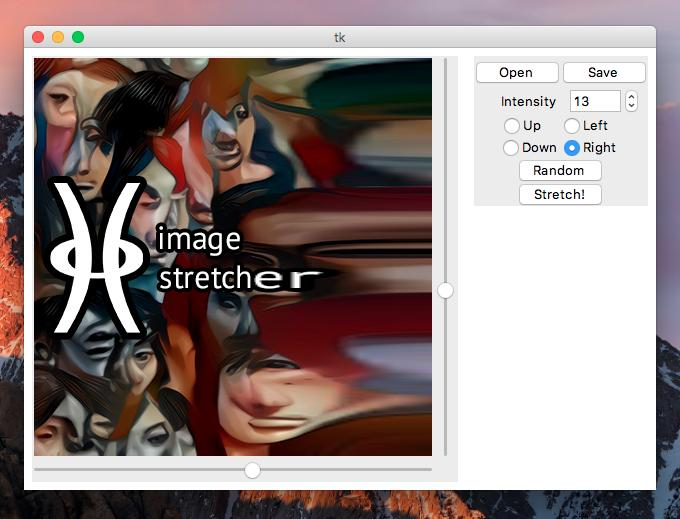

# Image Stretcher  
Application built using Python, PIL, NumPy and Tkinter (GUI). 
Incrementally stretches an image in any cardinal direction, starting at any pixel of your choice. 

 

Requirements: Python3, Pillow, Numpy, Tkinter  
To operate the stretcher: Choose your direction, move the slider to the desired stretch-starting place, and press the Stretch! button. 
Alternatively, you can just push the random button these choices will be made for you.
